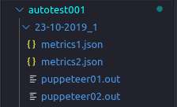
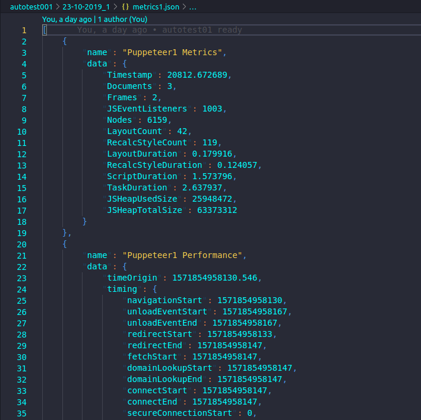

# autotest003

## About

This script runs 2 puppeteer instances and gets the Metrics and the Performance stats.

This script is about BreakoutRooms testing while creating and connecting multiple Bots to a Breakoutroom of a Meeting.

This script generates execution folder with the name `Date_ExecutionNum` (example: `01-01-2019_1`) inside autotest001 folder.

This script generates the log files `puppeteer01.out` and `puppeteer02.out` and the Metrics in `metrics1.json` and `metrics2.json` file.

## Running

To run, execute `./autotest003/run.sh *URL*`

or also running: 

```
cd autotest003
./run.sh
```

~~~bash
./autotest002/run.sh https://bbb-website.com
~~~

The default script will launch the clients it needs on the server you describe in the URL.

## Screenshots

The outputs of `puppeteer01.js` and `puppeteer02.js` will be displayed as in the picture below:


The metrics will show something like this:


## ToDo

- [ ] Add URL when running the command to be able to point on the Server you want to test.
- [ ] Check the generated Metrics in the `metrics1.json` and `metrics2.json` file.
